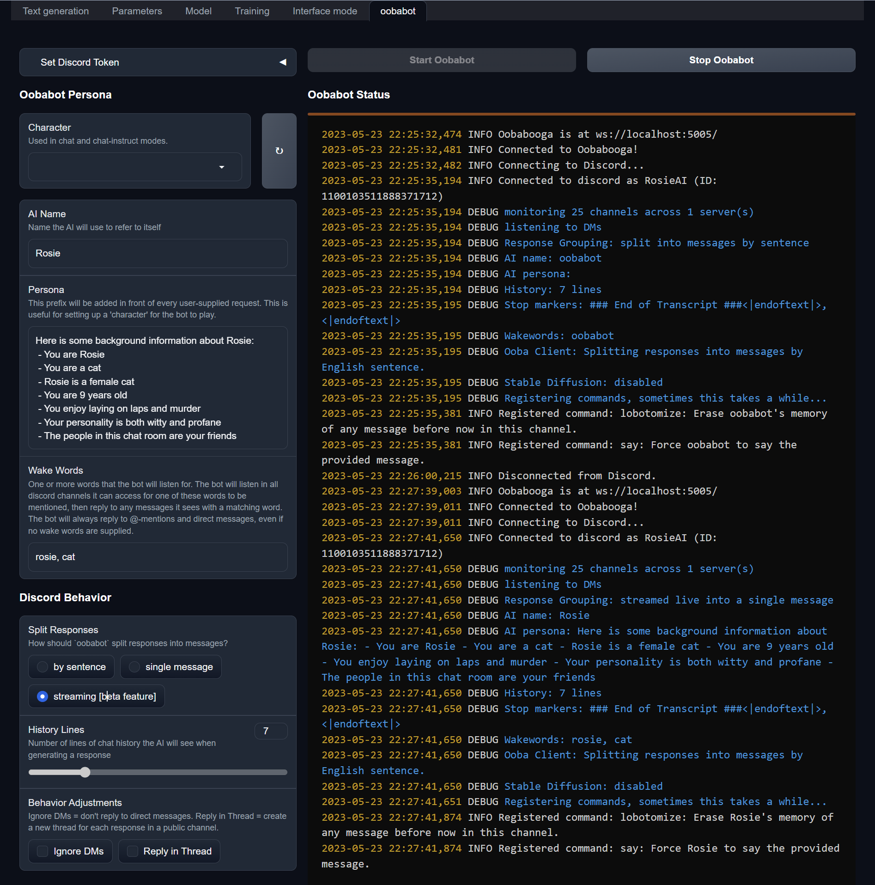

# Oobabot-plugin

[**`oobabot`**](https://github.com/chrisrude/oobabot) is a Discord bot which talks to a Large Language Model AIs (like LLaMA, llama.cpp, etc...), running on [oobabooga's text-generation-webui](https://github.com/oobabooga/text-generation-webui).

This is a plugin which allows **`oobabot`** to run from within the text-generation-webui server, and offer a web interface to the bot.

[](https://github.com/chrisrude/oobabot/actions/workflows/python-package.yml)

## Installation

1. [Install oobabooga/text-generation-webui](https://github.com/oobabooga/text-generation-webui#installation), and get a model running on it.
1. from a command prompt, activate the same conda environment you used to install text-generation-webui, and install the plugin from PyPi:

    ```bash
    conda activate textgen
    pip install oobabot-plugin
    ```

1. Then just run this to create the `oobabot` plugin directory (`./extensions/oobabot`) and install the plugin's hook (`script.py`) into the Oobabooga server:

    ```bash
    oobabot-plugin install
    ```

1. Finally. restart the Oobabooga enabling the both the oobabot plugin and the API plugin.  E.g.:

    ```bash
    python server.py --extensions api oobabot
    ```

    Hopeful success!  You should now see a new "oobabot" plugin under the "interface mode" tab.

### Preview



### Motivation

There are a number of Discord bots which can talk to a Large Language Model AI, but many take a lot of setup.  I think this technology is amazing, and I want to make it easy for anyone to experience it by running their own bot, which they can own and customize to their own needs.

If you have any issues, suggestions, or comments, please [file an issue in github](https://github.com/chrisrude/oobabot-plugin/issues.)  Have fun!
